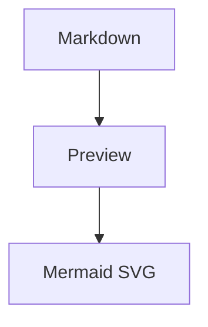

# Markdown Chrome

Markdown Chrome is a Chrome Manifest V3 extension for opening, previewing, editing, and exporting local Markdown files. It is built for local-first Markdown workflows: files stay on the user's machine, Mermaid diagrams render in the preview, and writable file saves happen only after the user grants file access through Chrome.

## Features

- Open `.md` and `.markdown` files from Chrome or through the extension toolbar.
- Drag a Markdown file or folder into the viewer to open it.
- Open a folder and browse Markdown files in a collapsible, resizable file tree.
- Use split view, fullscreen preview, or fullscreen editor mode.
- Edit Markdown with a beginner-friendly formatting toolbar.
- Render GitHub Flavored Markdown with task lists and tables.
- Render inline and display LaTeX formulas with KaTeX.
- Render imported citation markers as readable citation badges instead of raw private tokens.
- Click task-list checkboxes directly in the rendered preview; the source Markdown updates from `- [ ]` to `- [x]` or back.
- Render Mermaid diagrams from fenced code blocks.
- Save and auto-save through Chrome's File System Access API after the user grants write access.
- Refresh the current file or folder from disk on demand.
- Export rendered Markdown as standalone HTML.
- Export PDF through Chrome's print dialog.
- Switch between light and dark themes.

## Install Locally

1. Open `chrome://extensions`.
2. Enable `Developer mode`.
3. Click `Load unpacked`.
4. Select the local `MarkdownChrome` project folder.
5. Open the extension details and enable `Allow access to file URLs`.

## Use

Open a local `.md` or `.markdown` file in Chrome. If file URL access is enabled, the extension redirects the tab into the Markdown Chrome viewer.

You can also click the Markdown Chrome toolbar icon from any page to open the viewer, then use:

- `Open`: choose a Markdown file without typing a local file URL.
- `Open Folder`: choose a folder and browse all Markdown files in a file tree.
- Drag and drop: drop a `.md` / `.markdown` file or a folder anywhere in the viewer to open it.
- `Files`: show or hide the folder tree.
- `Refresh`: reload the current file or refresh the open folder tree from disk.
- `Split`: editor and rendered preview side by side.
- `Preview`: rendered Markdown fullscreen.
- `Editor`: Markdown editor fullscreen.
- `Save`: write the editor contents to the writable file handle.
- `Auto-save`: save later edits automatically after a writable file handle exists.
- `HTML`: download a standalone rendered HTML document.
- `PDF`: open a printable rendered document so Chrome can save it as PDF.
- `Dark` / `Light`: switch themes.

The editor toolbar includes common Markdown inserts for headings, bold, italic, links, quotes, lists, code blocks, tables, and Mermaid diagrams.

## Task Lists

Markdown task lists render as clickable checkboxes in the preview:

```markdown
- [ ] Draft release notes
- [x] Verify Mermaid rendering
```

Clicking a rendered checkbox updates the source Markdown in the editor. If auto-save is enabled and the file has write access, the changed task state is saved back after the normal auto-save delay.

## Mermaid

Mermaid diagrams render from fenced code blocks:



Use the same fenced block syntax in your own files: start a code block with three backticks followed by `mermaid`.

Markdown Chrome uses a compatible Mermaid rendering pipeline:

- Supported diagram types such as flowcharts, sequence diagrams, class diagrams, ER diagrams, state diagrams, and XY charts render first through `beautiful-mermaid` for cleaner SVG output.
- Unsupported diagram types, or diagrams that fail in `beautiful-mermaid`, automatically fall back to the official Mermaid renderer.
- All renderers are vendored locally so the extension does not need remote code to preview diagrams.

## LaTeX Formulas

Markdown Chrome renders inline and display math with KaTeX:

```markdown
Inline math: $E = mc^2$

$$
\int_0^1 x^2 dx = \frac{1}{3}
$$
```

Formula text inside code blocks is left unchanged.

## Saving Local Files

Chrome extensions cannot silently write to arbitrary `file://` paths. The first time you save, Chrome asks you to choose the source file so the extension can receive a writable file handle. After that, `Save` writes immediately and `Auto-save` keeps later edits synchronized while the page remains open.

Folder mode uses Chrome's directory picker. Markdown files opened from that folder can be saved through their file handles after the user grants folder access.

Use `Refresh` to reload the current file or folder from disk after external edits or folder changes. If the editor has unsaved local edits, Markdown Chrome asks whether to keep the current edits or discard them and load the disk version.

## Privacy Model

Markdown Chrome is local-first:

- It does not upload Markdown files.
- It does not send file content to a remote server.
- It does not include analytics, ads, or tracking.
- It uses local vendored JavaScript for Markdown and Mermaid rendering.
- It requests `file:///*` host access only so local Markdown file URLs can be detected and opened in the viewer.

## Agent Skills

This project also includes local Codex agent skills for future maintenance:

- `build-markdown-chrome-extension`: use when building or maintaining Markdown Chrome features such as local file access, folder navigation, Mermaid rendering, exports, and save-back behavior.
- `test-chrome-extension-ui`: use when verifying Chrome extension UI behavior, MV3 manifest validity, Mermaid rendering, layout regressions, and Chrome packability.

Example prompts:

```text
使用 build-markdown-chrome-extension 继续改这个插件
```

```text
使用 test-chrome-extension-ui 验证这个 Chrome 插件
```

## Verify

```bash
npm test
npm run verify:static
npm run verify:viewer
```

For Chrome package validation:

```bash
'/Applications/Google Chrome.app/Contents/MacOS/Google Chrome' --pack-extension="$PWD"
```

Remove generated `.crx` and `.pem` files after validation unless you are intentionally keeping a package artifact.

## Build Release ZIP

Chrome Web Store uploads use a ZIP file with `manifest.json` at the root.

```bash
npm run build:release
```

The release ZIP is written to `dist/markdown-chrome-<version>.zip` and includes only production extension files:

- `manifest.json`
- `src/`
- `vendor/`
- `icons/icon-16.png`
- `icons/icon-32.png`
- `icons/icon-48.png`
- `icons/icon-128.png`

Development files such as `node_modules`, `tests`, `docs`, and `store-listing` are excluded.

## Chrome Web Store Preparation

Store listing drafts and review checklists live in `store-listing/`:

- `chrome-web-store-listing.md`
- `privacy-practices.md`
- `test-instructions.md`
- `release-checklist.md`

Official references:

- [Publish in the Chrome Web Store](https://developer.chrome.com/webstore/publish)
- [Chrome Web Store Program Policies](https://developer.chrome.com/docs/webstore/program-policies/policies)
- [Configure extension icons](https://developer.chrome.com/docs/extensions/develop/ui/configure-icons)
- [Supplying Chrome Web Store images](https://developer.chrome.com/docs/webstore/images)
