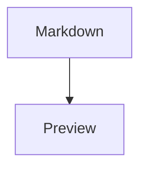

# Chrome Web Store Test Instructions

These instructions can be pasted into the Developer Dashboard test instructions field.

## No Account Required

Markdown Chrome does not require login, credentials, payment, or external services.

## Reviewer Steps

1. Install the extension.
2. Open `chrome://extensions`.
3. Open the details page for Markdown Chrome.
4. Enable `Allow access to file URLs`.
5. Create a local file named `sample.md` with this content:

````markdown
# Markdown Chrome Review

- [ ] Clickable task


````

6. Open `sample.md` in Chrome.
7. Confirm the extension opens the Markdown Chrome viewer.
8. Confirm the preview renders the heading, task list, and Mermaid diagram.
9. Click the rendered task checkbox and confirm the editor changes `- [ ]` to `- [x]`.
10. Click `Open` and select a Markdown file to verify picker-based open.
11. Click `Open Folder` and select a folder containing Markdown files to verify the file tree.
12. Click `Save` and choose the same Markdown file to grant write access.
13. Toggle `Dark` / `Light`.
14. Click `HTML` to verify HTML export.
15. Click `PDF` to verify Chrome opens the print dialog.

## Expected Behavior

All Markdown content is processed locally in Chrome. No account, network service, or remote API is required.
